#  EasyTFT
This is LoL's(League of Legends) one of game mode TFT(Team Fight Tatics) user help website project.  
You can use this website for get TFT related information and helped deck making.  
if you want to use this website, click the link below.  
https://hogeun1999.github.io/EasyTFT/  

The picture below is the main screen of the website.  

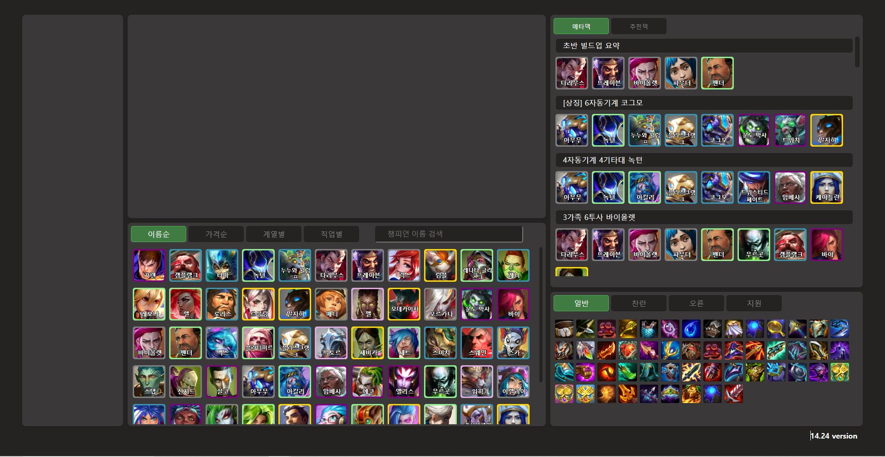  

# Contents
1. [Function](#1-function)
2. [Project progress](#2-project-progress)
3. [Additional updates](#3-additional-updates)

# 1. Function

## 1.1. TFT Information
You can get TFT information to this website.  

If you want to know Champion skill & ability or Item stats, just move your mouse on it's image.  
You can change the champion arrangement  by click the button on the champion box.  
Item boxes have the same function.  

<div>
  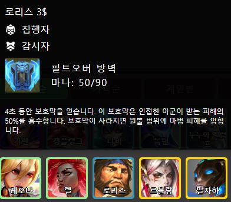
  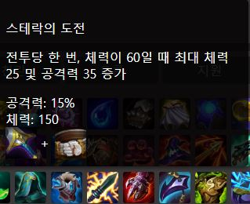
</div>
<br>  

If you want to know the traits information, click champion in chPampion box.  
Then the champion's traits you selected will added trait box.  
Move your mouse on trait and you can get trait information.

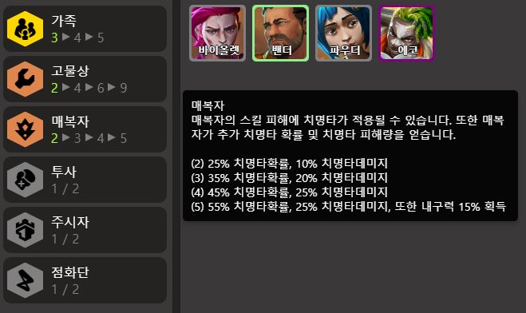  
<br>

\* **Caution** \*  

Roit(Game developer) doesn't provide basic data. (champion,item...)  
But some users created a tft open api community. And i also got information from there. (https://raw.communitydragon.org/)  
So sometimes data isn't clear. If I have time, I try to edit the data myself.  
You will not have any difficulty using the functions of this website.  
  
  
## 1.2. Units setting & Recommend Deck
Here is the main features why i created this website.  
It's **Recommend Deck** funtion.  
TFT isn't easy game. If game season changed, all user shoud study for playing game.  
New champion, item, trait, meta deck... Even the meta deck changes with each patch. 

If you use this function, you can find meta deck easy. Just click on the champion you have.  
It recommends the meta deck and the most recent #1 deck based on the champions you have.  

for example, you choose 3 champion. At this time othing on recommend deck list.  

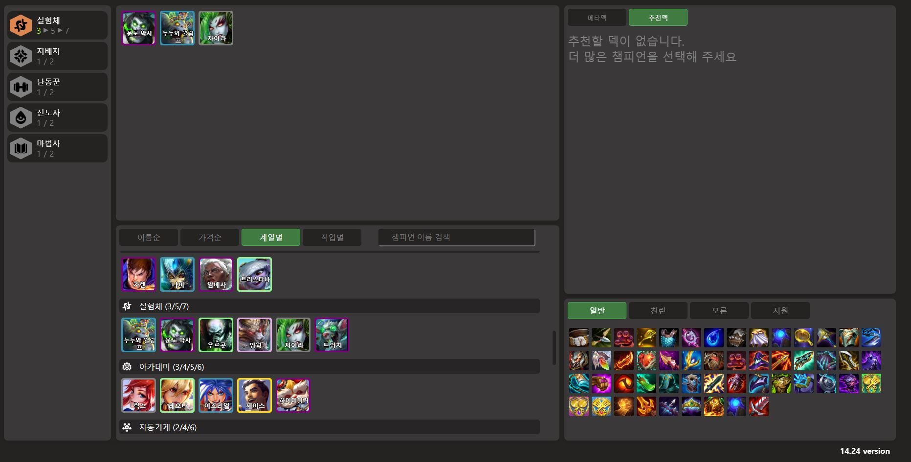
<br>

The minimum requirement for recommend deck list to have at least 5 champions selected.
If you select the appropriate 5 champion, you can see the recommend deck list like picture below.

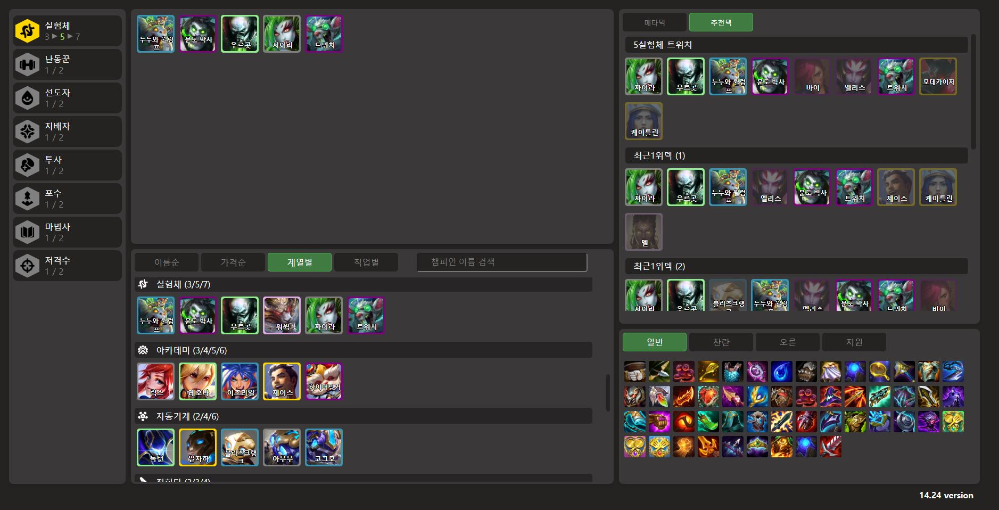
If you use this function well, you can enjoy the game without studying.

## 1.3. How to use
The picture below is an example of usage.  
Click on the image of the champion you want to use or are currently using in the box.  
Next, when you click on "Meta Deck Button," it recommends a deck based on the selected champion.  
You can easily create a deck by viewing the latest top 1 deck.  


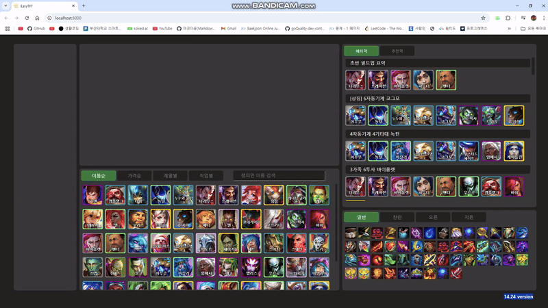

# 2. Project progress
## 2.1. React & Python
This project was developed using React, HTML, CSS, and Python.  
React was used to handle repetitive components and to easily modify each component when the data structure changes.  
Python was used to retrieve data from the Riot Open API and the TFT community.  
The Python code contains the Riot Open API key, and since there is no need to fetch data in real time, it is not uploaded to Git.  


## 2.2. Data collection
Since the types of data needed are diverse, such as items, champion data, and traits...  
the data collection process was divided into functions based on the type of data.  
This approach has the advantage that data collection functions without changes do not need to be modified during updates.  
So during updates, maintenance becomes simple by applying the data collection code just once.
```python
def getTraitsData():
    url = 'https://raw.communitydragon.org/14.24/cdragon/tft/ko_kr.json'  
    destination_file_path = os.path.join(os.getcwd(), '..', 'EasyTFTweb' ,'public','TFTtraitsData.json')
    response = requests.get(url)
    if response.status_code == 200:
        data = response.json()  
        traitList = []
        for i in range(len(data['setData'][-1]['traits'])):
                traitList.append(data['setData'][-1]['traits'][i])
        with open(destination_file_path, 'w', encoding='utf-8') as destination_file:
            json.dump(traitList, destination_file, ensure_ascii=False, indent=4)
        print(f"JSON 데이터가 현재 작업 디렉토리에 저장되었습니다: {destination_file_path}")
    else:
        print(f"API 호출에 실패했습니다. 상태 코드: {response.status_code}")

def getItemData():
  ...
```
## 2.3. Data processing
Since the data is created collaboratively by community users, it does not always have a consistent structure.  
Additionally, there are cases where the data may be missing.  
In such cases, I manually processed the data as much as possible, but there may still be missing data.  
If you encounter any issues while using it, please report them.  

*example
The data below is the description of a certain trait.  
Various @characters@ and <tags> were modified to process the data into the description shown below.  
However, in the case of this trait, the descriptions for (4) and (6) were missing from the retrieved data from the beginning, which may appear as data loss.
```js
"desc": "자동기계가 피해를 입힐 때 수정을 획득합니다. 수정이 @TriggerNumCrystals@개가 되면 현재 대상에게 폭발을 일으켜 마법 피해+이전 폭발 이후 입힌 피해량의 
<magicDamage>@ConversionDamagePct*100@%</magicDamage>만큼 피해를 입히고 초기화됩니다. 
또한 자동기계가 방어력 및 마법 저항력을 얻습니다.
<br><br><expandRow>(@MinUnits@) <magicDamage>@MagicDamage@</magicDamage>의 피해, @Resists@ %i:scaleArmor%%i:scaleMR%</expandRow>",
```
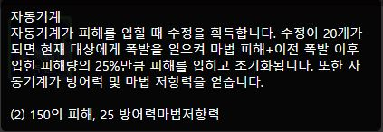

<br>
Please understand that these errors may have occurred because this website was created by a single developer and does not generate any revenue.

## 2.4. Recommend & Meta Deck logic
First, the data used for the recommended deck logic is from Riot's Open API, specifically the most recent 5 matches of Challenger players.  
This data was processed according to the following rules to determine the recommended deck.  

1. The recommended deck is the deck of the player who ranked 1st in the match.
2. The recommended deck includes at least 5 champions that overlap. 
3. Decks with a higher number of overlapping champions are prioritized for recommendation.
4. Decks that include emblem items were excluded.
5. Decks with the same champion appearing more than once were excluded.  
6. Up to 5 decks that satisfy the above rules are recommended. 

The recommended deck was selected based on the following rules.  

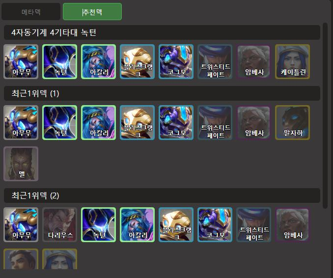  
<br>

The meta deck was sourced from the website at this link. (https://lolchess.gg/meta)  
The meta deck is also recommended if it overlaps with at least 5 champions, and it takes priority over other recommended decks.  

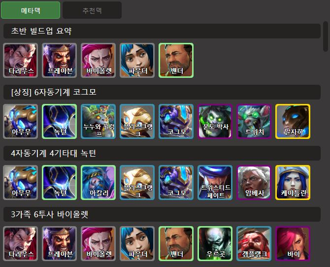  


# 3. Additional updates
## 3.1. Item statistics 
Currently, the website only provides combination recipes and basic descriptions for items.  
It is not possible to know which items suit each champion or which items are used in decks.  
It was something that wasn't considered when designing the initial website, but as the project progressed, I realized that adding tools related to items would be a great addition.  
Creating statistics and recommendation data related to items is not easy.  
Therefore, I will take some time and add tools related to items in a future update.  
Update plan  

 1. Item statistics for champions. 
 2. Add items to the champion icons in the recommended decks.
 3. Add trait items informaiton.  

The image below is from the item analysis section of metaTFT, and it is expected to have a similar layout.  

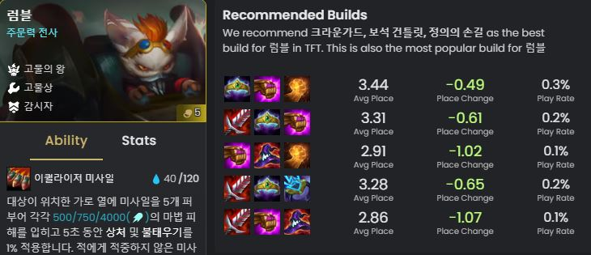  

## 3.2. clean data  
1. I will organize the champions, items, and various data as much as possible to avoid confusion.  
2. Many data changes with each update, and this will be improved to update automatically.


